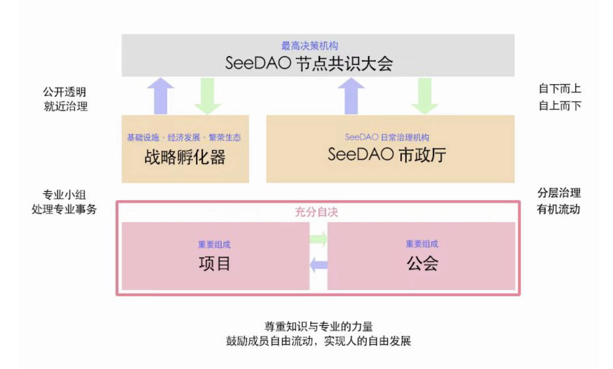

## SeeDAO 元规则 (版本: SIP-2)

论坛提案链接：https://forum.seedao.xyz/thread/39871

### 序言

SeeDAO 是一个基于区块链的数字城邦，其表现形态为去中心化的数字网络（SeeDAO Network）和映射在全球各地的物理据点 ( SeeShore )，由SeeDAO成员共建、共治、共享。

作为一个数字城邦，SeeDAO强调人的重要性，强调代码服务于人。除金库里的流动性资产外，由SeeDAO成员在共同创造过程中凝结的社会关系、积累的公共资产、形成的组织规则和历史记忆，均为SeeDAO的宝贵财富。

SeeDAO致力于满足成员对经济基础、公共服务与治理等多方面的诉求，促进身在城邦中人的自由发展。

### 第一章 SeeDAO成员的权利与义务

1. 成员是SeeDAO基本单元。SeeDAO的一切权限、责任、收益、风险，最终与SeeDAO成员相关。

2. 满足以下任一条件者，均可被认定为SeeDAO成员：
    a. SeeDAO PoW账本上被记录的贡献者；
    b. SeeDAO SGN 或 身份 MSC 持有者。

3. SeeDAO成员享有知晓SeeDAO历史、接受SeeDAO教育、参与PoW获得薪酬回报、竞选SeeDAO公共岗位、监督SeeDAO公共服务、维护SeeDAO公地利益、依据SeeDAO规则自由表达、依据贡献度参与相应层级治理之权利。

4. 与之相应，SeeDAO成员具有同步SeeDAO PoW 账本、在DAO内参与工作前明晰相应权责利、维护SeeDAO公地利益、遵守SeeDAO元规则及相应规则并保护其不受践踏之义务。

### 第二章 SeeDAO的治理原则及架构

#### 2.1 治理原则

1. SeeDAO遵循自下而上与自上而下相结合、分层治理、有机流动、公开透明的治理原则。

2. SeeDAO采用分层治理结构，鼓励就近治理、专业小组处理专业事务，充分尊重知识与专业的力量。

3. SeeDAO鼓励成员依据专长和兴趣爱好在各个公共岗位、各个公会、各个项目之间流动，充分利用SeeDAO资源进行创造，并积极参与SeeDAO各层级治理，实现人的自由发展。

4. SeeDAO公共岗位招聘、国库资产进出、重大公共事务决策、PoW账本更新应该保持公开透明，以便于接受社区成员的监督。

#### 2.2 治理架构

依据上述治理原则，SeeDAO建立了如下治理架构：

由SeeDAO节点构成的SeeDAO节点共识大会是SeeDAO的最高决策机构。大会每三个月召开一次，遵循一人一票的原则，对SeeDAO的重要事项进行决策；

由SeeDAO公共服务者构成的SeeDAO市政厅是SeeDAO的日常治理机构，每三个月轮换一次。SeeDAO的日常治理事项由市政厅负责，具体运行细节参见《SeeDAO治理手册》。

SeeDAO战略孵化器负责SeeDAO的经济发展，孵化SeeDAO发展所需的基础设施，充实SeeDAO的金库。战略孵化器的治理原则是专家治理。

公会和项目是SeeDAO的重要组成部分。在不违反《SeeDAO元规则》及《SeeDAO治理手册》的情况下，公会和项目均享有自决权。

### 第三章 节点共识大会

#### 3.1 节点
1. 参与SeeDAO的公会、项目和SeeDAO公共服务活动越多，成员的贡献度越高。在一个治理季度内，为SeeDAO贡献到一定程度以上的社区成员成为该季度的SeeDAO节点。

2. SeeDAO节点享有参与SeeDAO节点共识大会，对SeeDAO重大事务进行决策并获取相应激励之权利；同时，也具备对SeeDAO发展尽责之义务。

3. 节点的产生、延续及激励的具体细节，参见《SeeDAO节点共识大会规则》。

#### 3.2 节点共识大会
1. 节点共识大会是SeeDAO的最高权力机构，每三个月召开一次。

2. 参与共识大会的SeeDAO节点是大会所有事项的决策者，实行一节点一票的投票原则。

3. 由市政厅负责组织召开节点共识大会大会，其细节参见《SeeDAO节点共识大会规则》。

4.节点共识大会具备的权力有：

1. 听取市政厅和战略孵化器上一季度的工作汇报，评定市政厅的工作成绩；

2. 选举下一届市政厅公共服务人员，公示战略孵化器的工作人员名单；

3. 审批下一季度给予市政厅的预算及战略孵化器申请的季度额外预算；

4. 决策由市政厅提出的除《治理手册》外的其他II级规则新增、删减、修改提案，判定SeeDAO其他社区规则是否违反元规则；

5. 对SeeDAO成员的重要提案进行决策；

6. 决定下一届节点共识大会节点的门槛。

5.执行上述权力时，投票节点数超过当季节点总数的50%，且赞成票占所有投票的比例超过50%方可执行；

6.节点共识大会具备修改SeeDAO元规则的权力，见”第八章：元规则实行及修改“。

### 第四章：市政厅
1. 市政厅是 SeeDAO 的公共服务机构，负责 DAO 层面的治理事务。

2. 市政厅内设有各自独立、平级运作的公共岗位，共同对全 DAO 提供治理服务。除部份以时薪或按次计算、月结的岗位，薪酬支付方式以每一季结束后补偿为原则。

3. 市政厅具有以下权力：

    a.提出 SeeDAO在一个治理季度内的活动计划。

    b.依据《SeeDAO治理手册》，为SeeDAO的日常治理服务，包括社区运营、品牌公关、媒体账户、对外联络、财务管理、SeeDAO融资、线下空间法律及会计事务等。

    c.协助并完善 SeeDAO 成员日常发起的社区提案。

    d.发起《SeeDAO治理手册》修改提案及《SeeDAO节点共识大会》修改提案。

    e.依照《SeeDAO节点共识大会组织规则》按期筹备和召开节点共识大会。

4. 市政厅有向节点共识大会提交当季工作回顾、下一季度预算申请之义务。

5. 市政厅设有一个多签的链上金库，称作市政厅金库。每一季经由大会通过预算建议后，由社区金库打入所需资金，补充金库到当季要求。市政厅金库资金用于 SeeDAO 成员提案，且不得以预支社区金库名义超额承诺发放。

6. 市政厅所有岗位一季一任，每一季结束后需在节点共识大会重新选举。

### 第五章：战略孵化器
战略孵化器是孵化 DAO 基础设施、为 SeeDAO 造血、扩大 SeeDAO 生态的主要战略小组。

#### 5.1 战略孵化器的使命
1. 孵化 SeeDAO 以及生态所需的基础设施，为数字城邦提供 DAO 的底层操作系统。

2. 为 SeeDAO 造血，实现经济可持续发展。

3. 向 Web3 输出 DAO 时代基础设施，繁荣 SeeDAO 生态，形成 D2D 网络。

#### 5.2 战略孵化器的治理
1. 在治理架构上，战略孵化器与市政厅平级，按季度向 SeeDAO 节点共识大会汇报工作，并在成立之初一次性申请全部运营预算。

2. 战略孵化器采用偏中心化方式运作，由专家治理，自行决定内部岗位、任期和换届事宜。

#### 5.3 战略孵化器的权力
1. SeeDAO 使用何种 DAO Tool 以及其他基础设施由战略孵化器决定。

2. 战略孵化器代表 SeeDAO 与被孵化项目展开谈判，并签署协议。

3. 为宣传战略孵化器和所孵化项目，战略孵化器有权使用 SeeDAO 品牌和媒体账号。

4. 战略孵化器初始孵化资金为 100 万 U，全部用于孵化项目。

#### 5.4 金库管理与收益分配
战略孵化所获取的全部收益（Token、NFT以及其他资产）由孵化器根据市场情形转化为 U，其中相应比例归 SeeDAO 公共金库，相应比例作为孵化器相关人员激励，由孵化器决定。

### 第六章：公会与项目
1. SeeDAO 公会是由具有相同技能专长和兴趣爱好的 SeeDAO 成员，一同围绕相关主题讨论交流、发起活动而形成的组织。公会能起到为SeeDAO蓄积和培养专业人才、提供专业教育、促进人才交流协作的作用。

2. SeeDAO 项目是从 SeeDAO 中发起的有计划性、目的性的组织，将围绕在项目规划上进行各项活动，其类别包括兴趣小组、公会内部项目、SeeDAO公共项目、SeeDAO孵化项目及短期项目等。

3. 无论公会与项目，皆需遵循 SeeDAO 治理手册相关约定。

4. 在不违反《SeeDAO元规则》和《SeeDAO治理手册》的情况下，公会与项目享有自决权。其他平行公会、社区项目、战略孵化器、市政厅与节点共识大会有义务尊重公会自决权，且除8.1.3所示情况外，无权干涉公会与项目自决权范围内事务。

### 第七章：SeeDAO代币经济模型
SeeDAO的token代号为$SEED，总量 10 亿枚。其中25%归属于CryptoC团队（包含给予第一轮投资人的token），15%归属于A轮及之后的SeeDAO投资人，60%归属于社区。预计$SEED的发行时间为2024年2月。

其中，归属于社区的6亿枚$SEED，有1亿枚用于SeeDAO发展的其他需求。余下的5亿枚$SEED token，全部由社区贡献者以“POW”的形式挖出，并记录到 POW 账本。

#### 7.1代币产生
由社区贡献产生的$SEED，按照每年上限 5 千万枚（占总量5%）的速度根据“POW”原则释放 。在理想情况下（每年 $SEED的POW产量都达到 5% 上限），10年后社区部分会全部释放。

##### 1. POW原则

    a. 所谓通过POW原则发放 $SEED，是指贡献在适当参考市场价格与SEED未来成长性的基础上，按照$SEED的公认价值来计算发放$SEED的数量。

    b. 在POW原则下，$SEED的释放速度取决于两个条件：$SEED的价格和贡献总量的参照价格。

    c. 关于SeeDAO认定的POW类别及相应激励，参见《SeeDAO治理手册》。

##### 2. 治理挖矿：奖励参与节点共识大会的节点

    a. 根据POW原则，SeeDAO给予构建和维护SeeDAO网络的节点相应奖励。节点参与SeeDAO治理而获得相应token激励的行为即为治理挖矿；

    b. 治理挖矿是 POW 的一部分，其挖矿产生的 $SEED 被包含在 POW 每年上限 5% 的预算之内；

    c. 治理挖矿数额为该治理季度除治理挖矿以外POW所产生token数量的二十分之一。

#### 7.2 代币解锁
代币解锁的原则是社区POW部分不锁仓，CryptoC与第一轮投资人执行最为严格的锁仓标准。其他投资人根据签署的协议明确锁仓时间。

### 第八章：元规则实行及修改
#### 8.1 元规则的实行
1. 依照 SeeDAO 的治理结构，SeeDAO 的规则相应分为三个级别：

    a. SeeDAO 元规则为 I 级规则；

    b. 除 SeeDAO 元规则外，其他涉及到整个 SeeDAO 治理范围的规则为II级规则；

    c. SeeDAO内部各公会和项目自行制定，仅适用于公会和项目内部的规则为III级规则。

2. 在SeeDAO设立的 II 级规则和 III 级规则均不得与 SeeDAO 元规则相悖，否则视为无效。

3. 共识大会可判定 II 级规则和 III 级规则是否违反元规则。

4. 共识大会对 II 级规则及其修订案具备是否通过的决定权。

5. 在第一届节点共识大会召开之前，市政厅出台的《SeeDAO节点共识大会临时规则》和《SeeDAO治理临时手册》具有与《SeeDAO节点共识大会》规则与《SeeDAO治理手册》同等效力。

#### 8.2 元规则的修改
如需修订元规则，则元规则修订案需由超过三分之一的SeeDAO前届节点向当届SeeDAO节点共识大会共同提案，并由超过三分之二的当届节点赞成方可生效。

元规则修订案通过后，由SeeDAO节点共识大会授权SeeDAO市政厅完成版本更新和发布。